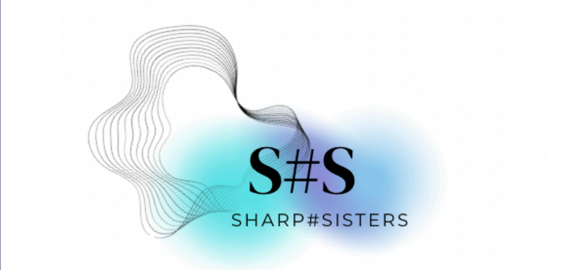
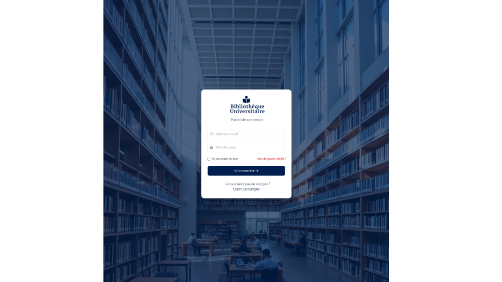

  

<h1 align="center">📚 IHECTHEQUE – Application de Gestion de Bibliothèque</h1>

---

##  Présentation du projet
IHECTHEQUE est une application développée dans le cadre d’un projet universitaire.
Elle permet de gérer une bibliothèque universitaire en digitalisant
les livres, les utilisateurs et les emprunts.

L’application propose des interfaces adaptées aux différents profils :
étudiant, bibliothécaire et administrateur.

---

##  Objectifs du projet
- Faciliter l’accès aux ressources documentaires  
- Optimiser la gestion des emprunts et des retours  
- Centraliser les informations  
- Améliorer l’expérience utilisateur  
- Digitaliser les services de la bibliothèque  

---

##  Fonctionnalités principales
- Authentification des utilisateurs  
- Gestion des livres  
- Suivi des emprunts  
- Interface étudiant, bibliothécaire et administrateur  
- Statistiques et rapports  
- Système de notifications  

---

##  Aperçu de l’interface

### Authentification & Accueil

  
  

### Espaces Utilisateurs

  
  
  

### Gestion des Livres

  

---

##  Technologies utilisées
- C#  
- .NET  
- Visual Studio  
- Base de données  

---

##  Documentation
- Rapport du projet  
- Présentation académique  

---

## Exécution du projet
Le projet est exécutable via Visual Studio
en ouvrant le fichier de solution `.sln`.

---

